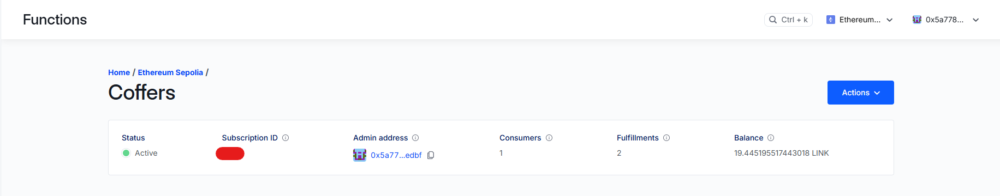
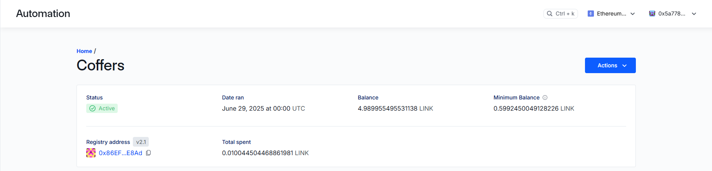

# Coffers : Unlock Power of Tokenized RWAs
Coffers is a project built for Chromion: Chainlink hackathon 2025.

## Links and addresses (Mainly for Hackathon)

### Contracts
1) Address of Main.sol deployed on sepolia chain : 0x32116049E79985D6eF2D8819478D7939A0a38F2e
2) Address of Asset.sol deployed on sepolia chain : 0x1Edd34e7750E640C85944bF178C224A51438737C
3) Address of Lending.sol deployed on sepolia chain : 0xAE4A7Df792c089346B210f231cb89Efaf7597Af2
4) Address of GetActivity.sol deployed on sepolia chain : 0xB63465e2731488E2569Ff565822Fc1d93D12D37D
5) Address of LiquidationAutomation.sol deployed on sepolia chain : 0xf0c2E76674BdE10042441f4031Ae7BD1a724676f

### Video Link
https://vimeo.com/1097193506?share=copy#t=0
#### Note :
For the demo, the website interaction was done through local chain while the elizaO agent interaction was done through GetActivity contract actually deployed on sepolia.

Link to Post : https://x.com/ShivRai576498/status/1938954462808416707


### Chainlink specific
1) Address of GetActivity.sol deployed on sepolia chain : 0xB63465e2731488E2569Ff565822Fc1d93D12D37D   
GetActivity.sol uses Chainlink functions

2) Address of LiquidationAutomation.sol deployed on sepolia chain : 0xf0c2E76674BdE10042441f4031Ae7BD1a724676f
LiquidationAutomation.sol uses Chainlink Automation

3) Address of Main.sol deployed on sepolia chain : 0x32116049E79985D6eF2D8819478D7939A0a38F2e
Main.sol uses Chainlink DataFeeds (ETH/USD)

## Important Sections

| Section | Description |
|---------|-------------|
| [Introduction](#introduction-to-coffers) | Overview of Coffers platform |
| [RWAs](#rwas) | Real World Asset tokenization features |
| [DeFi](#defi) | Decentralized Finance lending and borrowing |
| [Twitter Integration](#twitter-integration) | Social media wallet connection features |
| [Activity Points](#activity-points) | User participation verification system |
| [ElizaOS Agent](#elizaos-agent) | AI agent integration |
| [Contracts](#contracts) | Smart contract documentation |
| [Running the Project](#running-the-project) | Setup and deployment instructions |

## Introduction to Coffers
Coffers is your on-chain solution for tokenizing your assets and then using them on-chain.

### RWAs
#### Creating an asset
Coffers allows you to tokenize an asset by :
1) Providing a name
2) Providing a description
3) Providing an image of the asset
4) Providing a document to prove your ownership of the asset

#### Viewing your assets
You are able to view all your assets you possess.

#### Sell assets
You are able to put your assets for sale on the site.

#### Buy assets
You are able to buy assets put up for sale by others

### DeFi

#### Putting up asset as collateral
You can put up any asset you own as collateral to ask for a loan.

#### Borrowers
When asking for a loan, borrowers have to:
1) Select the asset for collateral
2) Amount wanted for loan
3) Days for which the loan is wanted

Borrowers have to pay the loan amount along with 10% interest within the time period. Else the lenders can liquidate and borrowers will lose possession of the asset.

#### Lenders
Lenders can provide loans to borrowers. They will receive 10% of the amount as interest. If loan isnt repaid within the time period asked by the borrower, lenders can liquidate loan and become the new owner of the asset put up as collateral by the borrower.   


### Twitter Integration

Coffers has twitter integrations that allows users to connect their wallets with twitter on the website. User need to connect twitter only once to store the relation between their twitter handle and wallet address in the database. Multiple wallet addresses can have a single twitter handle.

#### Twitter lookup
This feature allows users to see the twitter handle of a particular wallet address or see the wallet addresses of a particular twitter handle.

### Activity Points
Acitivity points are a feature of the contracts that allows users to verify participation of another user with the contract. Acitivity points are rewarded (1 each) for :
1) Buying asset (awarded 1 to each buyer and seller)
2) Funding Loan
4) Repaying Loan
4) Liquidation Loan

### ElizaOS Agent
Due to integration of ElizaOS agent with twitter, users can ask for activity points of someone's twitter handle and eliza agent will fetch the user wallets connected to the twitter handle and the activity points of each wallet. This allows users to easily verify the participation and verification of other users.


forge test --match-path "test/*"

## Contracts

### src

#### Main.sol
The main contract from which all of the user interactions happen.

#### Asset.sol
The contract responsible for creating and managing state of assets.

#### Lending.sol
The contract responsible for DeFi part of Coffers

#### LiquidationAutomation.sol
Contract that is used to implement chainlink automation

#### GetActivity.sol
Contract that is used to implement chainlink functions to work with ElizaOS agent.

#### MockPriceFeed.sol
Mock of chainlink price feed for local chain.

### test
Run the tests using command :
```
forge test --match-path "test/*"
```

#### tests.t.sol
Contains tests for Main, Asset and Lending Contract

#### GetActivity.t.sol
Contains test for GetActivity.sol

### script

#### Deploy.s.sol
Deploy Main, Lending and Asset contracts
#### DeployAct.s.sol
Deploy GetActivity contract
#### DeployLiquidationAutomationScript.s.sol
Deploy LiquidationAutomation.sol


## Frontend
Contains the frontend files required to run a web interface.

## Eliza
Contains the files required to run the ElizaOS Agent


## Running the project

### Contracts
The following libraries need to be installed:
1) forge-std
2) openzeppelin-contracts
3) chainlink-brownie-contracts

#### Note
Line 101 in Lending.sol :
```
loan.deadline=loan.startTime+(loan.deadline*1 days);
```
Line 102 in Lending.sol :
```
loan.deadline=loan.startTime+(loan.deadline*1 seconds);   
```

The contract deployed to Sepolia testnet for demo of Chromion has line 101 as uncommented and 102 as commented i.e. deadline is taken in days.
If you are deploying on localchain or dont want to wait for days, you can use line 102 (uncomment it) and comment line 101 i.e. deadline will be in seconds.   
Right now, the line 102 is in use by default, manually make the change according to your preference.   
   

In order to deploy the contracts follow these steps:
1) Run anvil in one terminal if u want to deploy to local chain
```
anvil
```
2) Run The following scripts to deploy the contract you want :
Main.sol, Asset.sol, Lending.sol :
```
forge script script/Deploy.s.sol --rpc-url <RPC_URL> --broadcast --private-key <PRIVATE_KEY>
```

##### Replace <RPC_URL> and <PRIVATE_KEY> according to the chain required.   
Following are the contracts required to work with chainlink 
GetAcitivity.sol :
Replace MAIN_CONTRACT_ADDRESS present in DeployAct.s.sol according to your Main.sol
```
forge script script/DeployAct.s.sol --rpc-url <RPC_URL> --broadcast --private-key <PRIVATE_KEY>
```

LiquidationAutomation.sol : 
Replace MAIN_CONTRACT_ADDRESS present in DeployLiquidationAutomationScript.s.sol according to your Main.sol
```
forge script script/DeployLiquidationAutomationScript.s.sol --rpc-url <RPC_URL> --broadcast --private-key <PRIVATE_KEY>
```

#### Note
GetActivity.sol and LiquidationAutomation.sol are right now set to deploy to sepolia testnet. Change the required variables for the chain your require.

### Frontend
1) Install the dependencies required:
```
npm install
```
2) Make a .env or .env.local file and fill up the required variables from .env.example

3) Run using the command:
```
npm run dev
```

#### NOTE
You will need to setup supabase and twitter api through twitter developer dashboard. 
For twitter OAuth, you will need to provide a website url. Since we are deploying the website on localhost and twitter doesnt take localhost as a valid url, you can use ngrok in order to create a valid url for twitter.
```
ngrok http 3000
```
You need to login and authenticate ngrok.
The above command works assuming you have authenticated ngrok and frontend is working on port 3000.

### Eliza
1) Install the dependencies required:
```
npm install
```
2) Make a .env or .env.local file and fill up the required variables from .env.example

3) Fill up the details like DON_HOSTED_SECRETS_VERSION, CHAINLINK_SUBSCRIPTION_ID, etc in Eliza/src/custom-plugins/config/getActivity.ts

4) Run using the command:
```
npm start
```


If done correctly all the commands should work correctly.   
Please reach out if you face any issue.